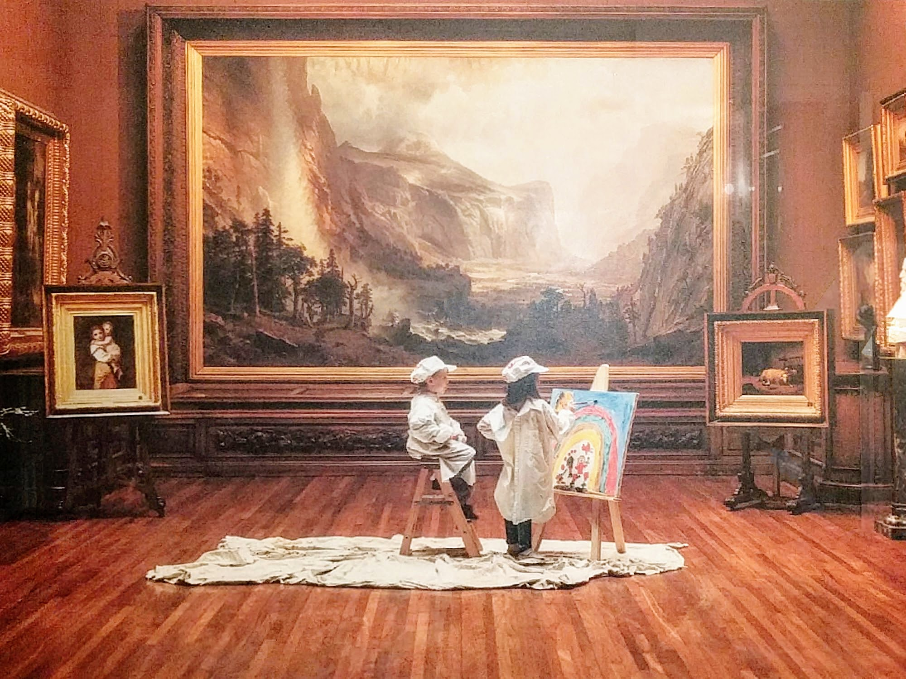

# bierstadt
Automated print cartography with node.js and d3.js

<small><a href="http://www.stjathenaeum.org/albert-bierstadt-the-domes-of-the-yosemite">The Domes of the Yosemite</a> - Albert Bierstadt, 1867<small>

